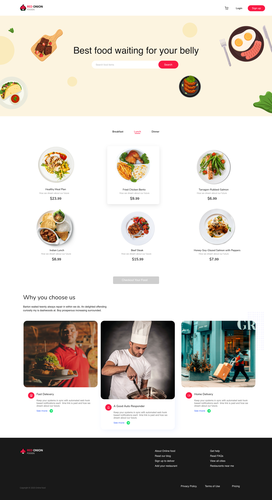

# HOT ONION RESTAURANT

hot onion restaurant is an ecommerce system which Client Side managed with React.js & bootstrap.

## What's included
 - Showed different different type of foods item in home page by selecting.
 - Food Ordering System are dynamically managed.
 - Displayed Cart Added Products Length at Cart icon in Navbar.
 - Authentication System (Google & Email) is managed with firebase
 - Tried to dynamically manage event handling keeping UX in mind. 
 - Integrated Stripe Payment Gateway.
 - Backend API managed express.js
 - Used MongoDB as Database.

## Installation
### Prerequisites
In order to install SCIPIO ERP, the following prerequisites must be installed:
 - NPM 
 - Git

### Download
1. Open your command line and run:
```js
$ git clone https://github.com/nazmul98/hot-onion-restaurent.git
```

### Installation Process
In order to install, the following steps must be taken:

1. Open your command line, go to the extracted folder and run:
```js
$  npm install
$  npm start
```

                    **Congratulations, you have installed Hot Onion Restaurant App!**

### How I built it
The web application backend is built on express.js. Data is stored in a MongoDB database. The application will be hosted on firebase. React.js, JS ES6 features, Bootstrap4, HTML5 and CSS3 is used in the front-end.

### Useful Links
 - Demo: https://hot-restaurant-app.web.app/
 - Server: https://github.com/nazmul98/hot-onion-restaurant-server

### Screenshot of Homepage
 